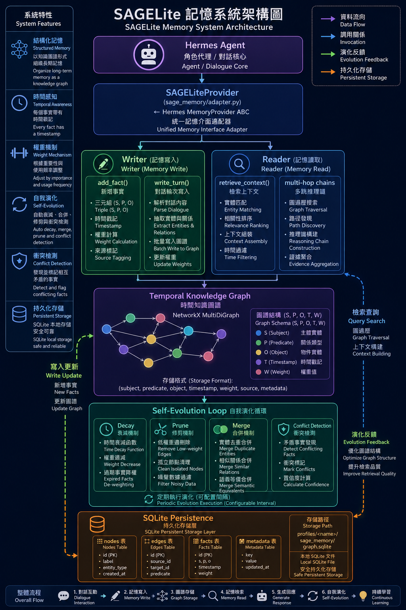

# hermes-sage-memory

> Causal graph memory plugin for [Hermes Agent](https://github.com/NousResearch/hermes-agent).
> Replace flat text memory with a self-evolving temporal knowledge graph — zero external dependencies.
>
> [Hermes Agent](https://github.com/NousResearch/hermes-agent) 的因果圖譜記憶外掛。
> 將平面文字記憶替換為自我演化的时间知识图谱——无外部依赖。

[]()
[]()
[]()

---

## Why SAGE-lite? / 為什麼用 SAGE-lite？

| | Hermes Built-in Memory<br>Hermes 內建記憶 | SAGE-lite |
|---|---|---|
| Structure 結構 | Flat text (MEMORY.md) | Causal graph (S→P→O) 因果圖譜 |
| Retrieval 檢索 | Keyword / vector snippet | Multi-hop causal traversal 多跳因果遍歷 |
| Self-correction 自我修正 | Manual rewrite 手動改寫 | Auto decay/prune/merge 自動衰減/修剪/合併 |
| Cross-session 跨 session | Fragmented 碎片化 | Profile-isolated SQLite 隔離存儲 |
| Context injection 上下文注入 | Full text dump 全文傾倒 | Top-K compressed summary 精選壓縮摘要 |
| External deps 外部依賴 | None | None (NetworkX + SQLite) |

---

## Quick Start / 快速開始

### Install / 安裝

```bash
pip install hermes-sage-memory
```

### Use as Hermes Plugin / 做為 Hermes 外掛使用

```bash
# Copy plugin entry to Hermes plugins directory
# 將外掛複製到 Hermes plugins 目錄
cp -r plugins/memory/sage_lite /path/to/hermes-agent/plugins/memory/

# Launch Hermes with SAGE-lite memory
# 以 SAGE-lite 記憶啟動 Hermes
hermes --memory-provider sage_lite
```

### Standalone Usage / 獨立使用

```python
from sage_memory import SAGELiteProvider

provider = SAGELiteProvider(top_k=5, max_hops=2, max_tokens=800)
provider.initialize("my-session", hermes_home="~/.hermes")

# Write a conversation turn / 寫入對話輪次
provider.sync_turn(
    user_content="I love hiking and I live in Queens, New York.",
    assistant_content="Got it, I'll remember that.",
    session_id="my-session",
)

# Retrieve relevant context / 檢索相關上下文
context = provider.prefetch("What do I enjoy?", session_id="my-session")
print(context)
# Memory
# - User: likes hiking(1.0), lives_in Queens(1.0)
```

---

## Architecture / 架構



```
Hermes Agent
│
▼
┌─────────────────────────────┐
│ SAGELiteProvider │ ← Hermes MemoryProvider ABC
│ (sage_memory/adapter.py)    │
└──────────┬──────────────────┘
           │
    ┌──────┴──────┐
    ▼             ▼
  Writer        Reader
  add_fact()   retrieve_context()
  write_turn()  multi-hop chains
    │             │
    └──────┬──────┘
           ▼
  Temporal Knowledge Graph
  NetworkX MultiDiGraph
  (S, P, O, timestamp, weight)
           │
           ▼
  Self-Evolution Loop
  decay / prune / merge
  conflict detection
           │
           ▼
  SQLite Persistence
  profiles/<name>/sage_memory/graph.sqlite
```

---

## Memory Lifecycle / 記憶生命週期

1. **Write 寫入** — `sync_turn()` extracts triples via pattern matching 透過模式匹配提取三元組
2. **Retrieve 檢索** — `prefetch()` scores by `weight × recency × relevance`，returns compressed summary 回傳壓縮摘要
3. **Evolve 演化** — scheduled decay ages old facts; `apply_correction()` handles user feedback 排程衰減舊事實；處理用戶反饋
4. **Persist 持久化** — WAL-mode SQLite with batch commits; JSON Lines export/import WAL 模式 SQLite 批量提交；JSON Lines 匯出入

---

## Recall Modes / 檢索模式

| Mode 模式 | Facts 事實 | Chains 鏈 | Token Use | Best For 適用場景 |
|---|---|---|---|---|
| `precise` | top 3 | none | minimal 最小 | Quick factual queries 快速事實查詢 |
| `balanced` | top 5 | top 2 | moderate 適中 | Default general use 預設通用場景 |
| `expansive` | top 10 | top 3 | higher 較高 | Deep reasoning tasks 深度推理任務 |

---

## Tools Exposed to Hermes / 暴露給 Hermes 的工具

| Tool 工具 | Description 說明 |
|---|---|
| `sage_add_fact` | Manually add a structured fact 手動新增結構化事實 |
| `sage_correct` | Decay / prune / merge a fact 衰減/修剪/合併事實 |
| `sage_recall` | Trigger manual recall with mode selection 手動觸發檢索 |
| `sage_stats` | Return graph health statistics 回傳圖譜健康統計 |

---

## Project Structure / 專案結構

```
hermes-sage-memory/
├── sage_memory/
│   ├── models.py          # Fact, ContextResult dataclasses
│   ├── graph_store.py     # NetworkX + SQLite (WAL, migration, export)
│   ├── writer.py          # Triple extraction + dedup + normalization
│   ├── reader.py          # Multi-hop retrieval + 3-mode recall
│   ├── evolution.py       # Decay / prune / merge + conflict detection
│   ├── token_utils.py     # Budget tracking + compression + cache
│   └── adapter.py         # Hermes MemoryProvider ABC implementation
├── integrations/
│   └── hermes_plugin.py   # register(ctx) entry point
├── plugins/
│   └── memory/sage_lite/
│       └── __init__.py
├── tests/                  # 110 tests, 0 external dependencies 無外部依賴
├── docs/
├── examples/
├── SAGE Lite架構圖.png    # Architecture diagram 架構圖
├── README.md
└── pyproject.toml
```

---

## Configuration / 設定

```python
provider = SAGELiteProvider(
    top_k=5,           # Facts retrieved per query 每查詢檢索的事實數
    max_hops=2,        # Graph traversal depth 圖譜遍歷深度
    max_tokens=800,    # Context injection budget 上下文注入預算
    recall_mode="balanced",  # precise / balanced / expansive
)
```

Or via Hermes config UI — SAGE-lite exposes `get_config_schema()` for interactive setup.  
或透過 Hermes 設定 UI——SAGE-lite 暴露 `get_config_schema()` 供互動式設定。

---

## Running Tests / 執行測試

```bash
pip install -e ".[dev]"
pytest tests/ -v
```

---

## Roadmap / 發展藍圖

- [ ] Async prefetch (background graph traversal) 異步預取（背景圖譜遍歷）
- [ ] LLM-assisted triple extraction (optional, pluggable) LLM 輔助三元組抽取（可選插拔）
- [ ] Neo4j backend adapter Neo4j 後端適配器
- [ ] Distributed graph store for multi-agent setups 多代理分散式圖譜存儲
- [ ] Web UI for memory graph visualization 記憶圖譜視覺化 Web UI

---

## License

MIT © 2026